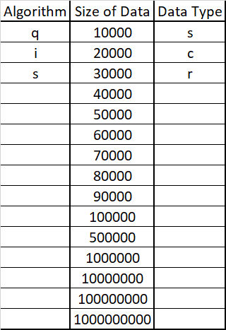
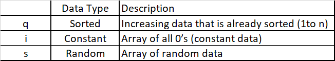

# Project 1
## Thiago André Ferreira Medeiros

### Environment
#### Hardware
PROCESSOR INTEL I9-9900K
32 GB DDR4 2666MHZ
GPU RTX 2080TI
GPU RTX 3090cd
SSD 1TB INTEL 660P SERIES M2
#### Software
OS Windows 11 Pro
Compiler CLION
Toolchain Mingw-w64 8.1.0
Language C++ 14

### How to run
This is a command line program (Project_1.exe).

It takes 3 arguments described in the below table:

The algorithms are:

The data types are:

Although the program accepts data sizes up to 1000000000,
due to memory limitations, it only works with up to 500000.

Example of valid entries:

(quicksort with 100000 sorted elements)
Project_1.exe q 100000 s

(insertion sort with 1000 constant elements)
Project_1.exe i 1000 c

(selection sort with 500000 random elements)
Project_1.exe s 500000 r
